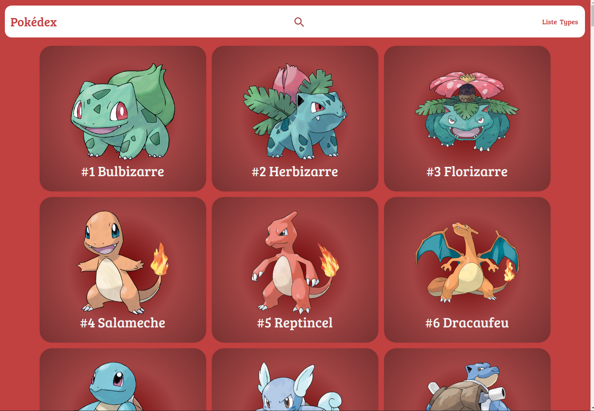
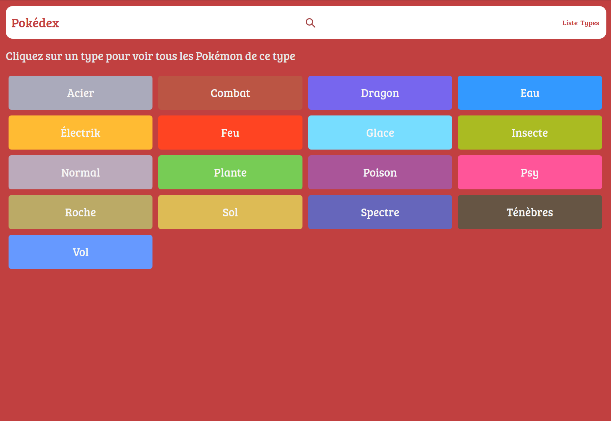
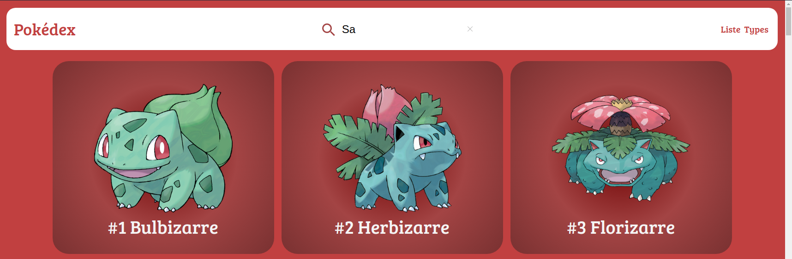
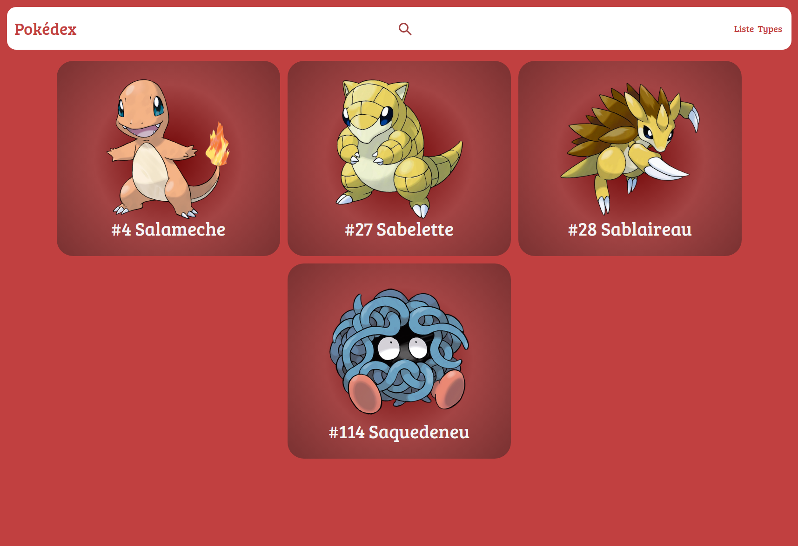

# Pokedex-App with Express/PG/EJS

## Table of Contents
- [Pokedex-App with NodeJS](#pokedex-app-with-nodejs)
  - [Table of Contents](#table-of-contents)
  - [General Information](#general-information)
  - [Technologies Used](#technologies-used)
  - [Screenshots](#screenshots)
    - [Page List](#page-list)
    - [Types Page](#types-page)
    - [Search Bar \& Search Results](#search-bar--search-results)
  - [Setup](#setup)
  - [Usage](#usage)
  - [Project Status](#project-status)
  - [Room for Improvement](#room-for-improvement)
  - [Acknowledgements](#acknowledgements)
  - [Contact](#contact)

## General Information
  This a node.js web application powered by Express, Postgres and EJS that provides views and informations about 1st Gen. Pokémon.
  I created this application to train on new concepts learned in class.

## Technologies Used
- EJS - version 3.1.8
- Postgres - version 12.6
- Node JS - version 15.12
- Express - version 4.18.2
- Sequelize - version 6.28.0

## Screenshots

### Page List

### Types Page

### Search Bar & Search Results

## Setup
Clone this repo to your desktop and run `npm install` to install all the dependencies.
Create an `.env` file and change the data necessary for the connection.
You must create and import the database present in the 'data' folder. 

## Usage
After you clone this repo to your desktop, go to its root directory and run `npm install` to install its dependencies.

Once the dependencies are installed and Database configure, you can run  `npm run dev` to start the application. You will then be able to access it at localhost:3000

## Project Status
Project is: _in progress_

## Room for Improvement

Room for improvement:
- Pokemons of all generation
- Responsive for other devices

To do:
- Using the Pokemon API

## Acknowledgements
Give credit here.
- This project was inspired by Ecole O'Clock

## Contact
Developed by [@lenny-zanotelli](https://www.linkedin.com/in/lenny-zanotelli/) - feel free to contact me!

